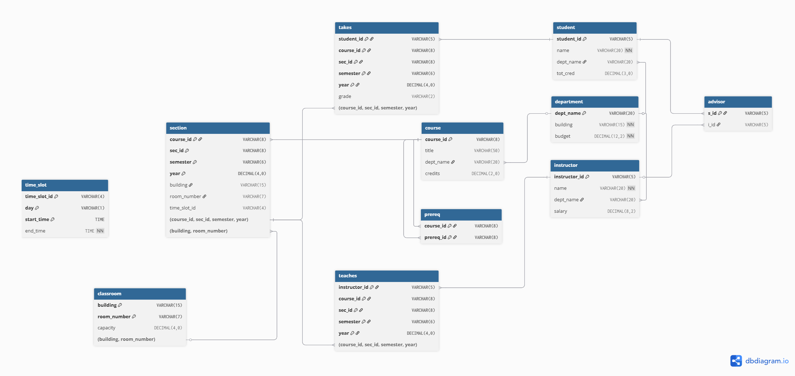

#  서울신학대학교 일반대학원 IT융합학과 데이터베이스 세미나<br clear="left"/>

## 📘 Project: University Database System Implementation

이 프로젝트는 **데이터베이스 시스템 세미나** 수업의 연구 및 실습을 위해 구축된 백엔드 애플리케이션입니다.  
표준적인 대학 학사 관리 시스템을 모델링하며, 대용량 트래픽 처리 및 쿼리 최적화 연구를 위한 베이스라인으로 사용됩니다.

---

### ⚖️ 출처 및 참고

본 프로젝트의 데이터베이스 스키마(Schema) 구조는 데이터베이스 분야의 표준 교재인 **[Database System Concepts]** (Abraham
Silberschatz, Henry F. Korth, S. Sudarshan 저)의 **University Database** 예제를 기반으로 하고 있습니다.

- **Schema Source:** *Database System Concepts (7th Edition)* Appendix A.
- **Purpose:** 본 프로젝트는 해당 스키마를 실제 RDBMS(MySQL)와 ORM(JPA) 환경에서 구현하고 최적화하는 과정을 연구하기 위한
  **교육 및 비상업적 목적**으로 개발되었습니다.
- **Data Notice:** 저작권 준수를 위해 교재 내부의 구체적인 데이터 값은 사용하지 않았으며, 모든 데이터는 더미 데이터 생성기(Faker)를 통해 무작위
  생성되었습니다.

---

### 🛠 기술 스택

최신 Java 생태계를 기반으로 구성되었습니다.

- **Language:** Java 21 (LTS)
- **Framework:** Spring Boot 3.x
- **Build Tool:** Gradle (Groovy)
- **Database:** MySQL 8.0
- **ORM:** Spring Data JPA (Hibernate)
- **Infra:** Docker, Docker Compose

---

**Korth의 University Database** 예제를 기반으로 설계되었습니다.

복합 키(Composite Key)와 순환 참조 관계를 명확히 시각화하기 위해 DBML을 사용하여 모델링하였습니다.


[DB ERD 다운로드(PDF)](docs/stcs_db_seminar_erd.pdf)

<details>
<summary><b>📂 DBML 스크립트 보기</b></summary>
<br>

```groovy
Table department
{
    dept_name VARCHAR(20)[primary key, note: '학과명']
    building VARCHAR(15)[not null, note: '건물명']
    budget DECIMAL(12, 2)[not null, note: '학과예산']
}

Table instructor
{
    instructor_id VARCHAR(5)[primary key, note: '교수 ID']
    name VARCHAR(20)[not null, note: '교수명']
    dept_name VARCHAR(20)[note: '학과명(FK)']
    salary DECIMAL(8, 2)[note: '월급']
}

Table student
{
    student_id VARCHAR(5)[primary key, note: '학생 ID']
    name VARCHAR(20)[not null, note: '학생명']
    dept_name VARCHAR(20)[note: '학과명(FK)']
    tot_cred DECIMAL(3, 0)[note: '총 이수 학점']
}

Table course
{
    course_id VARCHAR(8)[primary key, note: '강의 ID']
    title VARCHAR(50)[note: '강의명']
    dept_name VARCHAR(20)[note: '학과명(FK)']
    credits DECIMAL(2, 0)[note: '학점']
}

Table advisor
{
    s_id VARCHAR(5)[primary key, note: '학생 ID(FK) - 1:1 관계']
    i_id VARCHAR(5)[not null, note: '교수 ID(FK)']
}

Table prereq
{
    course_id VARCHAR(8)[primary key, note: '강의 ID(FK)']
    prereq_id VARCHAR(8)[primary key, note: '선수 과목 ID(FK)']
}

Table time_slot
{
    time_slot_id VARCHAR(4)[primary key, note: '수업 교시 ID']
    day VARCHAR(1)[primary key, note: '요일']
    start_time TIME[primary key, note: '시작 시간']
    end_time TIME[not null, note: '종료 시간']
}

Table classroom
{
    building VARCHAR(15)[primary key, note: '건물명']
    room_number VARCHAR(7)[primary key, note: '강의실 번호']
    capacity DECIMAL(4, 0)[not null, note: '수용 인원']
}

Table section
{
    course_id VARCHAR(8)[primary key, note: '강의 ID(FK)']
    sec_id VARCHAR(8)[primary key, note: '분반 ID']
    semester VARCHAR(6)[primary key, note: '학기']
    year DECIMAL(4, 0)[primary key, note: '년도']

    building VARCHAR(15)[note: '건물명(FK)']
    room_number VARCHAR(7)[note: '강의실 번호(FK)']
    time_slot_id VARCHAR(4)[note: '수업 교시 ID (논리적 참조)']
}

Table takes
{
    student_id VARCHAR(5)[primary key, note: '학생 ID']

    // Section 복합키 참조
    course_id VARCHAR(8)[primary key, note: '강의 ID']
    sec_id VARCHAR(8)[primary key, note: '분반 ID']
    semester VARCHAR(6)[primary key, note: '학기']
    year DECIMAL(4, 0)[primary key, note: '년도']

    grade VARCHAR(2)[note: '성적 (A+, B...)']
}

Table teaches
{
    instructor_id VARCHAR(5)[primary key, note: '교수 ID']

    // Section 복합키 참조
    course_id VARCHAR(8)[primary key, note: '강의 ID']
    sec_id VARCHAR(8)[primary key, note: '분반 ID']
    semester VARCHAR(6)[primary key, note: '학기']
    year DECIMAL(4, 0)[primary key, note: '년도']
}

Ref:
instructor.dept_name > department.dept_name
Ref:
student.dept_name > department.dept_name
Ref:
course.dept_name > department.dept_name

Ref:
advisor.s_id > student.student_id
Ref:
advisor.i_id > instructor.instructor_id

Ref:
prereq.course_id > course.course_id
Ref:
prereq.prereq_id > course.course_id

// Section은 Course와 Classroom을 참조
Ref:
section.course_id > course.course_id
Ref:
section.(building, room_number ) > classroom.(building, room_number )

// Takes는 Student와 Section을 참조
Ref:
takes.student_id > student.student_id
Ref:
takes.(course_id, sec_id , semester , year ) > section.(course_id, sec_id , semester , year )

// Teaches는 Instructor와 Section을 참조
Ref:
teaches.instructor_id > instructor.instructor_id
Ref:
teaches.(course_id, sec_id , semester , year ) > section.(course_id, sec_id , semester , year )
```

</details>

---

### ⚙️ 환경 설정

이 프로젝트는 민감한 정보(DB 접속 정보 등)를 `.env` 파일로 관리합니다.

프로젝트 루트 경로에 `.env` 파일을 생성하고 아래 내용을 작성해 주세요.

**`.env` 예시**

```properties
# MySQL 포트 설정 (기본값: 3306)
# 로컬 개발 환경에서 충돌 방지를 위해 3306 대신 다른 포트를 사용해도 됩니다.
MYSQL_PORT=3306
# MySQL 연결 정보
# 보안을 위해 비밀번호는 변경하여 사용하는 것을 권장합니다.
MYSQL_DATABASE=stcs_db
MYSQL_ROOT_PASSWORD=rootpassword
MYSQL_USER=stcs_user
MYSQL_PASSWORD=stcs_password
```

---

### 🚀 실행 방법

#### **사전 요구 사항**

- Docker & Docker Compose

#### 전체 시스템 실행

- 애플리케이션과 데이터베이스를 포함한 전체 환경을 실행합니다.

```shell
# 프로젝트 루트에서 실행
docker-compose up --build -d
```

#### 개발용 DB만 실행

- 로컬 개발 시 데이터베이스(MySQL)만 독립적으로 실행할 때 사용합니다.

```shell
# 개발용 MySQL 컨테이너 실행
docker-compose -f docker-compose-dev.yml up -d db-seminar
```

---

### 👤 작성자

- **이름:** 함상현
- **학과:** 서울신학대학교 일반대학원 IT융합학과
- **이메일:** hhak3504@stu.ac.kr
